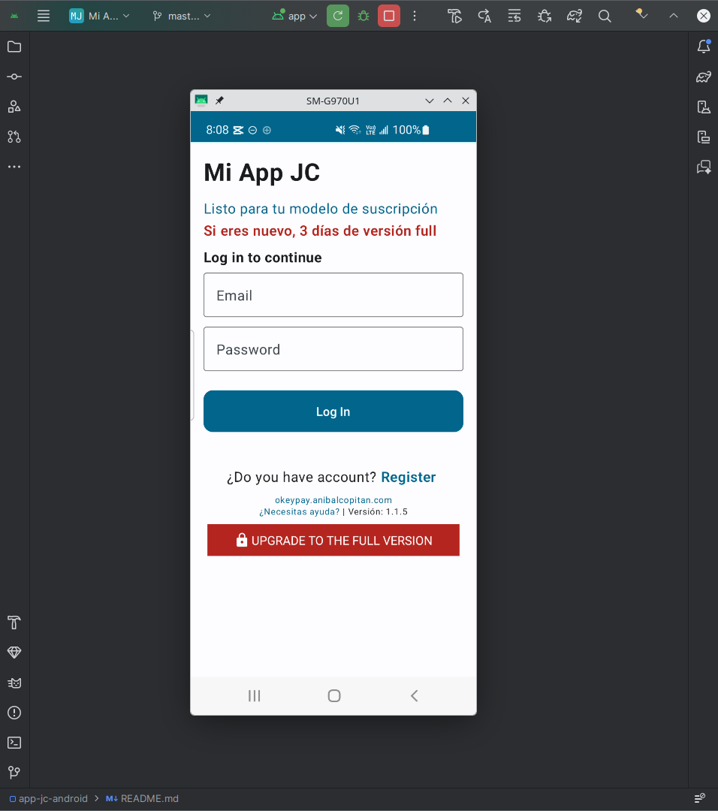

# Clase 01: Mi App JC

## 🎯 Objetivo
Crear tu propia aplicación Android usando una plantilla **App SaaS** profesional conectada con Google Sheets + AppScript como backend.

---

## ⏰ Duración
25 minutos aprox

---

## 📚 Nivel
Básico - Intermedio

---
# 🛠 Requisitos

- Android Studio instalado
- Cuenta Google
- Git instalado (opcional)
- Conexión a internet

----
## 📺 Video de la clase

[Ver clase en YouTube](https://youtu.be/6_zAv47YlsY)

---

# 🚀 Resultado final

Crear y personalizar tu propia App Android lista para conectar con un backend real.

- **Frontend:** Android Studio + Jetpack Compose
- **Backend:** Google Sheets + Google AppScript
- **API:** URL Web App generada con AppScript

---

# 🧠 Aprenderás

- Descargar proyecto .zip o clonar un proyecto Android desde GitHub
- Abrir proyectos Android correctamente en Android Studio
- Cambiar el Package Name de una aplicación
- Configurar correctamente el `applicationId`
- Modificar el nombre interno de la app
- Limpiar y reconstruir proyectos Android
- Usar Jetpack Compose Preview
- Ejecutar aplicaciones en emulador Android
- Crear un backend usando Google Sheets
- Crear APIs usando Google AppScript
- Desplegar un AppScript como Web App
- Conectar una App Android con AppScript
- Registrar usuarios desde Android hacia Google Sheets
- Validar login usando AppScript

---

# ✅ Resultado esperado

Al finalizar esta clase tendrás:

- Una App Android funcional
- Un backend real funcionando
- Una API conectada
- Login y registro operativo
- Base para subir tu app a Play Store